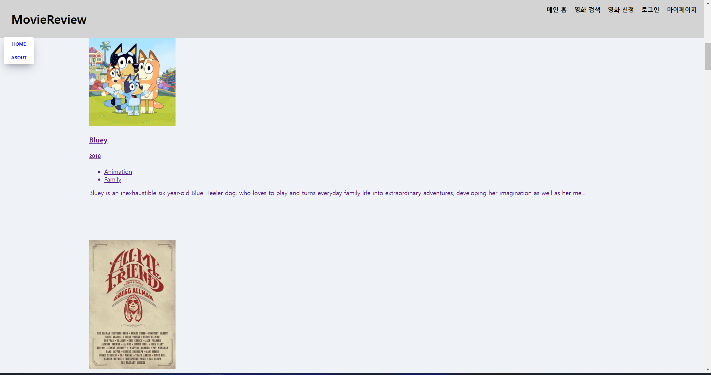
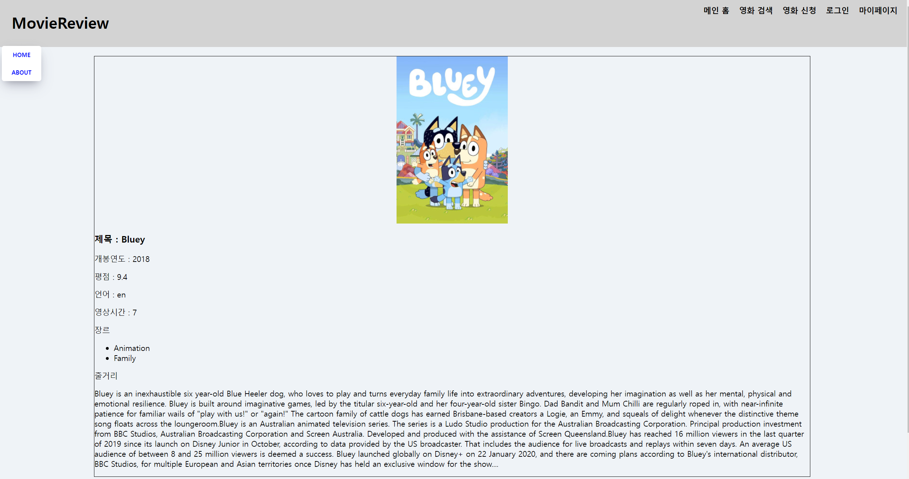

# Movie App 2024

React JS Fundamentals Course 2024

## 개요
JavaScript 언어의 React 프레임워크를 활용해 영화 리뷰 웹사이트를 클론 코딩한 프로젝트
참고 서적 : Do it! 클론 코딩 영화 평점 웹서비스

### 프로젝트 설명
HTML, CSS, JS 기본적인 구현 내용 및 설명 
리액트 프레임 워크 적용 
자바스크립트로 페이지 연결 및 공개 API 호출(axios) 
props와 location을 활용해 페이지간 데이터 전달

### 환경세팅
- node (20.10.0)
- npm (10.2.3)
- react (18.2.0)
- Editor : vscode 추천 (+확장 프로그램 추가 => Liver Server, Code Runner)

### 추가 참고 내용
- react 버전 변경으로 인해 페이지 간 데이터 전달 방법이 변경되었음, 책에 있는대로 하면 구버전이라 확인 불가능, 위에 적힌 새로운 방법 적용 필요
- react 새로운 버전으로 component 형태로 페이지 구현 가능 => 이 프로젝트에 적용된 클래스 방법보다 간소화 및 간단하게 데이터 전달 가능함, 다만 클래스가 아니므로 오는 단점도 존재
- 영화 정보 api 사이트 : https://yts.mx/api

